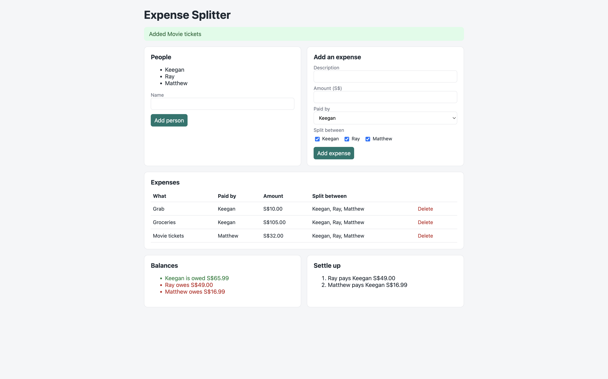
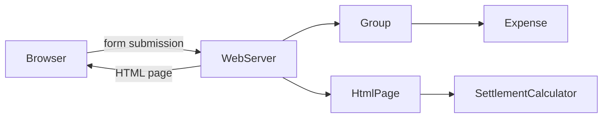

# Expense Splitter

A web app for splitting shared expenses among a group, like Splitwise. Add the people in a group, record who paid for what, and it works out everyone's balance and the fewest payments needed to settle up.

Built in plain Java with no frameworks, using only the Java standard library and JUnit for tests.



## Features

- Add people to a group and record shared expenses, split between any of its members
- **Fair splitting to the cent**: when an amount doesn't divide evenly, leftover cents are distributed so shares always add up exactly to the total
- **Balances** showing who is owed money and who owes money
- **Settle up**: a short list of payments that settles everyone, using a greedy algorithm with priority queues
- Clear validation messages for invalid input, such as unknown people, duplicate names or bad amounts
- Web interface served by Java's built-in HTTP server

## How it works

**1. Splitting an expense.** Amounts are stored in whole cents to avoid floating-point rounding errors. S$10.00 split three ways is 1000 cents: each person gets 333, and the 1 leftover cent goes to the first person, giving 334 + 333 + 333 = 1000.

**2. Balances.** For each expense, the payer's balance goes up by the full amount, and each person sharing it goes down by their share. A positive balance means others owe you; a negative one means you owe. Across a group, balances always add up to zero.

**3. Settling up.** People who are owed money and people who owe money are placed in two priority queues, largest amount first. Repeatedly, the largest debtor pays the largest creditor the smaller of their two amounts. Each payment fully settles at least one person, so a group of *n* people needs at most *n − 1* payments.

For example, after a S$60 dinner paid by Alice and split three ways, and a S$15 taxi paid by Bob and shared with Charlie:

| Person | Balance |
| --- | --- |
| Alice | owed S$40.00 |
| Bob | owes S$12.50 |
| Charlie | owes S$27.50 |

Settle up: **Charlie pays Alice S$27.50**, then **Bob pays Alice S$12.50**.

## Architecture

The calculation logic is completely separate from the web layer, so it could sit behind a different interface, such as a mobile app or command line, without changes.



| Class | Responsibility |
| --- | --- |
| `Money` | Converts between dollar text and cents |
| `Expense` | One shared cost, validated on creation, which splits itself fairly |
| `Group` | Members and expenses, and calculates balances |
| `Payment` | One "X pays Y" instruction (a Java record) |
| `SettlementCalculator` | Turns balances into payments using priority queues |
| `HtmlPage` | Builds the page as HTML, escaping user input |
| `WebServer` | Routes requests, reads form data and redirects after each action |

## Design decisions

- **Money in whole cents** (`long`), since decimal types like `double` can't represent values such as 0.1 exactly
- **Encapsulation**: objects validate their input in the constructor, so an invalid expense can never exist, and collections are exposed as read-only views
- **Choosing data structures deliberately**: a `LinkedHashSet` for members (no duplicates, insertion order kept), a `List` for expenses, maps for balances, and `PriorityQueue`s for the settlement algorithm
- **Deterministic results**: ties in the settlement algorithm are broken by name, so the same balances always produce the same payments
- **Post/Redirect/Get**: after every form submission, the server redirects back to the page, so refreshing never resubmits a form
- **XSS protection**: all user-entered text is escaped before being placed in the HTML
- **No frameworks**: routing, form parsing and page rendering are written explicitly, so every step of a request is visible in the code

## Project structure

```
src/main/java/com/raynald/splitter/
├── Main.java                  # starts the web server
├── Money.java
├── Expense.java
├── Group.java
├── Payment.java
├── SettlementCalculator.java
├── HtmlPage.java
└── WebServer.java
src/test/java/com/raynald/splitter/   # JUnit tests
```

## Getting started

**Requirements:** Java 21 and Maven.

```bash
git clone https://github.com/RaynaldCloud/expense-splitter.git
cd expense-splitter
mvn -q compile
java -cp target/classes com.raynald.splitter.Main
```

Then open http://localhost:8080.

## Running tests

```bash
mvn test
```

The tests cover parsing and formatting money, fair splitting (including leftover cents), balance calculations, the settlement algorithm (checking that applying the payments leaves everyone at zero, using at most *n − 1* payments), form parsing and HTML escaping.

## Limitations and future improvements

- Data is kept in memory and resets when the server stops; saving to a file or database would make it persistent
- Supports a single group; multiple groups would need a way to create and switch between them
- The greedy algorithm uses at most *n − 1* payments, which is optimal or near-optimal in practice; guaranteeing the absolute minimum in every case is a much harder problem
- Only equal splits are supported; splitting by custom amounts or percentages would be a natural extension

## Author

**Raynald Lim** · [LinkedIn](https://www.linkedin.com/in/raynald-lim/) · [GitHub](https://github.com/RaynaldCloud)